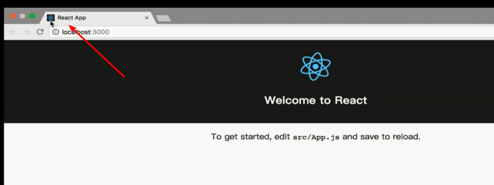

# React 学习(1)
> 【1-3章】

> 本项目使用 React Fiber 版本，也就是 React 16版本

- [React 官网](https://zh-hans.reactjs.org/)
- [React 官方教程](https://zh-hans.reactjs.org/tutorial/tutorial.html)

## 开发环境准备

- 使用打包工具：Webpack
- 使用官方脚手架工具：[Creat-react-app](https://zh-hans.reactjs.org/docs/create-a-new-react-app.html#create-react-app)
- 安装 Nodejs
- 安装 react-app: `npm install -g create-react-app`


## 项目启动

1. 新建项目（名字随意，建议英文）: `create-react-app todolist`
2. 完成步骤1后，按照提示：
   1. `cd todolist`
   2. `npm run start`
3.  在浏览器输入 `localhost:3000` ，即可看到预览效果


## 工程目录介绍

- `package.json` 文件：配置文件，前面的命令 `npm run start ` 实际上就是运行了`scripts`里面的 `start` 

- `.gitignore` 使用 git 工具管理代码，对于一些不想传到 github 上的东西，在此添加剂可

- `public` 

  - `favicon.ico` 浏览器 tab 上的 icon 图标
    
  - `index.html` 主页的模板，负责显示页面中 html 的内容

- `src`

  - `index.js` 项目的入口 

  ```js
  import React from 'react'; 
  import ReactDom from 'react-dom';
  import App from './App';
  
  // PWA progressive web application
  // 主要功能是帮助我们借助网页写手机应用
  //将该网页上传到 支持 https协议的服务器上，此时，网页若使用了registerServiceWorker，则其具备如下特性：
  // 在访问该网页以后，即使断网了，registerServiceWorker 可以帮助你把网页存储在浏览器之内，无网络也可以访问
  import  registerServiceWorker from './registerServiceWorker'
  
  ReactDom.render(<App/>, document.getElementById('root'));
  registerServiceWorker();
  
  
  ```

  - `App.test.js` 文件，是一个自动化的测试文件
  - `App.js` 文件，负责显示到页面的内容

## React 的组件

React 组件的编写： App.js 文件就是一个组件，我们可以换成 TodoList.js 文件

```js
import React, {Component} from 'react'

class TodoList extends Component{
    render(){
        return (
            <div>todolist</div>
        )
    }
}

export default TodoList;
```

说明，此处使用了 ES6语法： `import React, {Component} from 'react'`  等价于

```js
import React from 'react';  // 此处不同

//import {Component} from 'react';
//等价于
//import React from 'react';
//const Component  = React.Component;

class TodoList extends React.Component{  // 此处不同
    render(){
        return (
            <div>todolist</div>
        )
    }
}

export default TodoList;
```


需要注意：

```js
import React from 'react';
import ReactDOM from 'react-dom';
import TodoList from './TodoList';

ReactDOM.render(<TodoList />, document.getElementById('root'));
```

上面代码中，虽然我们没有使用到 `react` ，但是不能删除 `import React from 'react'` ，因为

```js
ReactDOM.render(<TodoList />, document.getElementById('root'));
```

这里使用你了 `JSX` 语法，将 `TodoList` 挂载到 `root` 中。

**必须引入 `react` 我们的代码才能够使用 `JSX` ，才能够编译成功。**

如果是在 `index.js` 文件中使用自定义组件，自定义组件 名字必须为 **“大写字母开头”**

## 写一个 TodoList Demo

> 使用 webstorm 遇到问题和解决办法：[webStorm保存文件时出现Following errors occurred on attepmt to save files:can't save...](https://blog.csdn.net/thaiilk/article/details/88569951)

Demo 代码如下：

```js
import React, { Component, Fragment} from 'react';

class TodoList extends Component{
    constructor(props){
        super(props);
        this.state = {
            inputValue: 'hello',
            list: []
        }
    }

    render(){
        return (
            <Fragment>
                <div>
                    <input type="text"
                           value={this.state.inputValue}
                           onChange={this.handleInputChange.bind(this)}
                    />
                    <button>提交</button>
                </div>
                <ul>
                    <li>学英语</li>
                    <li>Learn React</li>
                </ul>
            </Fragment>
        )
    }
    handleInputChange(e) {
        this.setState({
            inputValue: e.target.value
        })
        //this.state.inputValue = e.target.value  这里的 this 为undefined ，需要在前面事件中使用 bind 绑定
        //console.log(e.target.value)
    }
}

export default TodoList;
```

**学习要点：**

1. `state` 负责存储组件里面的数据
2. `HTML`  中，如果使用到 js 的表达式，需要使用 `{}` 括起来
3. 使用 `onChange` 事件时，需要绑定事件的 this ，后面的方法中的 this 才是正确的。
4. 在修改 `state` 中的数据时，不能够直接修改，而需要使用 `setState({key: value})` 对象的方式修改。 

接下来，我们对 TodoList 进行完善，看如下代码：

```js
import React, { Component, Fragment } from 'react';

class TodoList extends Component {

  constructor(props) {
    super(props);
    this.state = {
      inputValue: '',
      list: ['学习英文', '学习 React']
    }
  }

  render() {
    return (
      <Fragment>
        <div>
          <input type="text"
            value={this.state.inputValue}
            onChange={this.handleInputChange.bind(this)}
          />
          <button onClick={this.handleBtnClick.bind(this)}>提交</button>
        </div>
        <ul>
          {
            this.state.list.map((item, index) => {
              return <li key={index} onClick={this.handleItemDelete.bind(this, index)}>{item}</li>
            })
          }
        </ul>
      </Fragment>
    )
  }

  handleInputChange(e) {
    this.setState({
      inputValue: e.target.value
    })
    //this.state.inputValue = e.target.value
    //console.log(e.target.value)
  }
  handleBtnClick() {
    this.setState({
      list: [...this.state.list, this.state.inputValue],
      inputValue: ''
    })
  }
  handleItemDelete(index) {
    const list = [...this.state.list];
    list.splice(index, 1);

    this.setState({
      list: list
    })
    // this.state.list.splice(index,1); 不可以这样使用，修改数据必须使用 setState方法
    // 引入一个概念： immutable ，即 state 不允许我们做任何改变，否则会影响性能优化

    console.log(index)
  }
}

export default TodoList;
```

**上述代码中，新增了 2 个功能：**

- 输入内容后点击提交，下面会生成输入内容的列表
- 点击列表项，则可以删除该列表项

功能一**学习要点**：

1. 循环生成列表项，需要使用 index，不然会有警告！

```js
<ul>
  {
    this.state.list.map((item, index) => {
      return <li key={index} onClick={this.handleItemDelete.bind(this, index)}>{item}</li>
    })
  }
</ul>
```

2. 使用 ES6 语法，对数组进行处理，即进行数据添加：`[...this.state.list, this.state.inputValue]` ,

```js
handleBtnClick() {
    this.setState({
        list: [...this.state.list, this.state.inputValue],
        inputValue: ''
    })
}
```

3. 删除数组数据项的时候，需要先将数组拷贝一份，对拷贝到数组进行操作再使用 setState 进行数据赋值。

```js
handleItemDelete(index) {
    const list = [...this.state.list];
    list.splice(index, 1);

    this.setState({
        list: list
    })
    // this.state.list.splice(index,1); 不可以这样使用，修改数据必须使用 setState方法
    // 引入一个概念： immutable ，即 state 不允许我们做任何改变，否则会影响性能优化

    console.log(index)
}
```


## JSX 语法补充

在 render 方法中， return 后面括号内的就是 jsx 代码。

1. jsx 注释：` {/*这是一个多行注释*/}` ，注意，多行注释需要将注释内容单独一行，和花括号分别占一行，**不能在同一行。**

```jsx
render(){
  return (
    <Fragment>
      {/*这是一个多行注释*/}
      <div>
        {
          // 这是一个单行注释
        }
        <input type="text"
          value={this.state.inputValue}
          onChange={this.handleInputChange.bind(this)}
        />
        <button onClick={this.handleBtnClick.bind(this)}>提交</button>
      </div>
      <ul>
        {
          this.state.list.map((item, index) => {
            return <li key={index} onClick={this.handleItemDelete.bind(this, index)}>{item}</li>
          })
        }
      </ul>
    </Fragment>
  )
}
```


2. 写 css 的时候，使用 className 代替 class，避免和前面重名导致歧义

```jsx
<Fragment>
  <div>
    <input
      type="text"
      className="input"
      value={this.state.inputValue}
      onChange={this.handleInputChange.bind(this)}
    />
    <button onClick={this.handleBtnClick.bind(this)}>提交</button>
  </div>
  <ul>
    {this.state.list.map((item, index) => {
      return (
        <li
          key={index}
          onClick={this.handleItemDelete.bind(this, index)}
          dangerouslySetInnerHTML={{ __html: item }}
        ></li>
      );
    })}
  </ul>
</Fragment>;

```


2. 不转译 HTML ，使用 `dangeroutlySetInnerHTML` ，这样在提交文本框的时候，下面生成的内容则不会进行转译，如下代码：

```jsx
<ul>
  {this.state.list.map((item, index) => {
    return;
    <li
      key={index}
      onClick={this.handleItemDelete.bind(this, index)}
      dangerouslySetInnerHTML={{ __html: item }}
    />;
  })}
</ul>;
```

3. 使用 htmlFor 代替 for，比如常见的 label 中所使用

```jsx
<Fragment>
  <div>
    <label htmlFor="insertArea">请输入内容</label>
    <input
      id="insertArea"
      type="text"
      className="input"
      value={this.state.inputValue}
      onChange={this.handleInputChange.bind(this)}
    />
    <button onClick={this.handleBtnClick.bind(this)}>提交</button>
  </div>
  <ul>
    {this.state.list.map((item, index) => {
      return (
        <li
          key={index}
          onClick={this.handleItemDelete.bind(this, index)}
          dangerouslySetInnerHTML={{ __html: item }}
        ></li>
      );
    })}
  </ul>
</Fragment>;

```


## 组件拆分和组件之间的传值

1. 组件注释问题：

```jsx
 return (     
				<TodoItem content={item} index={index}/>
	{/*<li
			key={index} onClick={this.handleItemDelete.bind(this, index)}
			dangerouslySetInnerHTML={{__html:item}}></li>
			*/}
	)
```

在 jsx 中，若组件前后有注释时，需要使用 div 等对外层进行包裹，代码为：

```jsx
 return (
		<div>
		{/*<li
			key={index} onClick={this.handleItemDelete.bind(this, index)}
			dangerouslySetInnerHTML={{__html:item}}></li>
		*/}
	</div>
	)
```

2. 父子传值，在子组件上标注好属性，然后给子组件使用

```jsx
{/* 父组件 TodoList.js */}
return (
    <div>
        <TodoItem content={item} index={index}/>
    </div>
)
```

子组件使用父组件的传值：

```jsx
import React, { Component } from "react";

class TodoItem extends Component {
  constructor(props) {
    super(props);
    this.handleClick = this.handleClick.bind(this);
  }
  render() {
    return <div onClick={this.handleClick}>{this.props.content}</div>;
  }

  handleClick() {
    alert(this.props.index);
  }
}

export default TodoItem;

```

注意，这里调用 handleClick 方法绑定的 this，**子组件需要在 constructor 中绑定，而不是在事件中绑定**，目的是更节约性能。

错误写法：

```jsx
render() {
    return (
      <div onClick={this.handleClick.bind(this)}>{this.props.content}</div>
    )
  }
```


3. 子父传值：子组件操作父组件方法

前面的功能中，当点击列表项，则该列表项被删除。

父元素，TodoList.js

```jsx
  render() {
    return (
      <Fragment>
        <ul>
					{/* 省略部分代码 */}
          {
            this.state.list.map((item, index) => {
              return (
                <div>
                  <TodoItem
                    content={item}
                    index={index}
                    deleteItem={this.handleItemDelete.bind(this)}
                  />
                </div>
              )
            })
          }
        </ul>
      </Fragment>
    )
  }

  handleItemDelete(index) {
    const list = [...this.state.list];
    list.splice(index, 1);
    this.setState({
      list: list
    })
  }
```

子组件中：

```jsx
import React, {Component} from 'react'

class TodoItem extends Component{

    constructor(props) {
        super(props);
        this.handleClick = this.handleClick.bind(this)
    }
    render() {
        return (
            <div onClick={this.handleClick}>{this.props.content}</div>
        )
    }
    handleClick() {
        this.props.deleteItem(this.props.index)
    }

}
```


**重要学习要点！！！：**

- 当子组件操作 `deleteItem` 方法的时候，需要绑定父组件的 `this` 
- 子组件使用父组件传过来的值，或者是子组件操作父组件的方法时，子组件中都是用 `this.props.xxx` 的方式操作父组件的 `xxx` 方法或者 `xxx` 数据

## TodoList 代码优化

1. 使用 ES6 语法对子组件代码优化： `{ content,  index, delteItem } = this.props` 。

```jsx
 render() {
        const {content} = this.props;
        return (
            <div onClick={this.handleClick}>{content}</div>
        )
    }

    handleClick() {
        const {deleteItem, index} = this.props;
        deleteItem(index);
    }
```

2. 在初始化中完成对 this 的绑定

```jsx
{//...}
class TodoList extends Component {
  constructor(props) {
    super(props);
    this.state = {
      inputValue: "",
      list: ["学习英文", "学习 React"],
    };
    this.handleInputChange = this.handleInputChange.bind(this);
    this.handleBtnClick = this.handleBtnClick.bind(this);
    this.handleItemDelete = this.handleItemDelete.bind(this);
  }
  render() {
    return (
      <Fragment>
        <div>
          <label htmlFor="insertArea">请输入内容</label>
          <input
            id="insertArea"
            type="text"
            className="input"
            value={this.state.inputValue}
            onChange={this.handleInputChange}
          />
          <button onClick={this.handleBtnClick}>提交</button>
        </div>
        <ul>{this.getTodoItem()}</ul>
      </Fragment>
    );
  }
}

```

3. 将 jsx 中的逻辑内容换到方法之中，精简代码

```jsx
 render(){
		return (
			<Fragment>
					{//省略部分代码...}
					<ul>
							{this.getTodoItem()}
					</ul>
			</Fragment>
		)
}

getTodoItem() {
		return this.state.list.map((item, index) => {
			return (
				<div>
						<TodoItem
								content={item}
								index={index}
								deleteItem={this.handleItemDelete}
						/>
				</div>
			)
		})
}
```

4. 对于 `setState` 使用新的语法，即使用【返回函数】的方式换掉原来的对象设置的方式：

```jsx
{//旧代码}
handleInputChange(e) {
	this.setState({
			inputValue: e.target.value
	})
}
{//新代码}
handleInputChange(e) {
	const value = e.target.value;
	this.setState(() => ({inputValue: value}))
}
```

**注意：** 这里需要先将 `e.target.value` 放在外面，为了代码的性能优化，不然写成`this.setState(() => ({inputValue: e.target.value}))`会报错

```jsx
{//旧代码}
this.setState({
	list: [...this.state.list, this.state.inputValue],
	inputValue: ''
})
{//新代码}
handleBtnClick() {
	this.setState((prevState) => ({
		list: [...prevState.list, prevState.inputValue],
		inputValue: ''
	}))
}
```

**注意：** 这里函数有一个参数 `prevState` 表示 list 变更前的状态，即等价于 `this.state.list` 。

```jsx
{//旧代码}
handleItemDelete(index) {
	const list = [...this.state.list];
	list.splice(index, 1);
	this.setState({
			list: list
	})
}

{//新代码}
handleItemDelete(index) {
	this.setState((prevState) => {
		const list = [...prevState.list];
		list.splice(index, 1);
		return { list }
		}
	);
}
```

道理同上！

## React 特点

- 声明式开发（基础的前端开发中，基本都是在操作 Dom，使用 React 可以减少代码量）
- 可以与其他框架并存（React 的代码只对 `root` 有效，后面可以使用 jquery 等框架，不操作 `root` 即可共存）
- 组件化（大写字母开头，父子通信的特点）
- 单向数据流（父组件可以向子组件传值，但是子组件**绝不能改变**父组件传过来的值）
- 视图层框架（只局限于视图层，在大型项目中，仅仅只有 React 是远远不够的）
- 函数式编程（有利于前端自动化测试，对于一个个函数，只需要验证其输出结果即可判断该函数是否正确）


