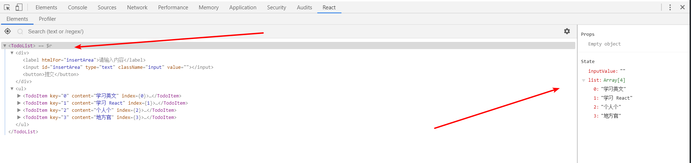
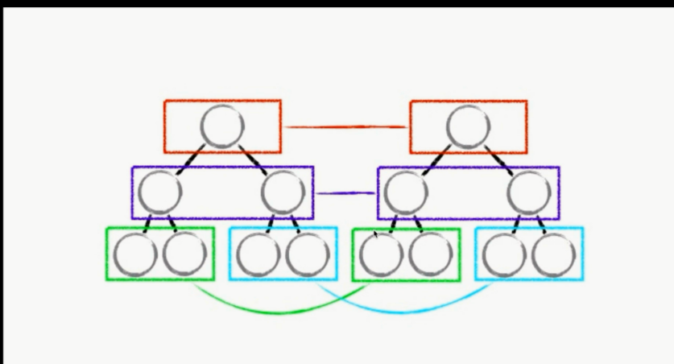
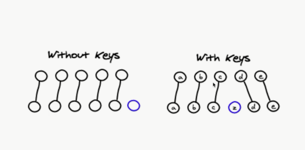
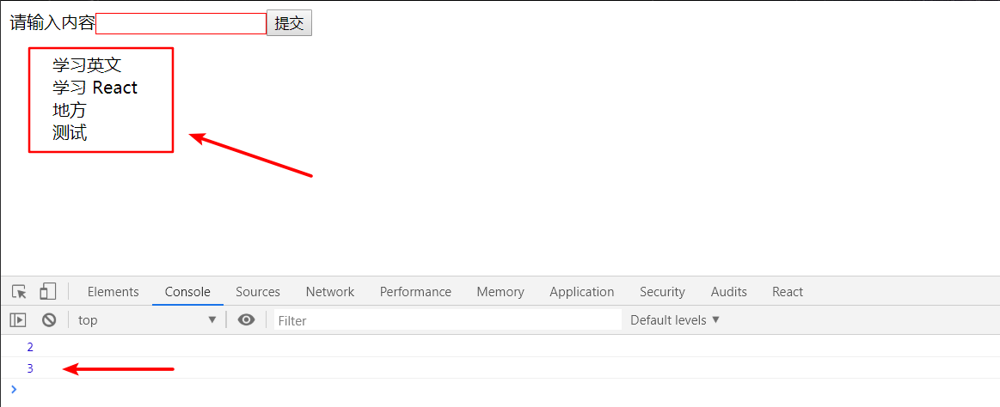
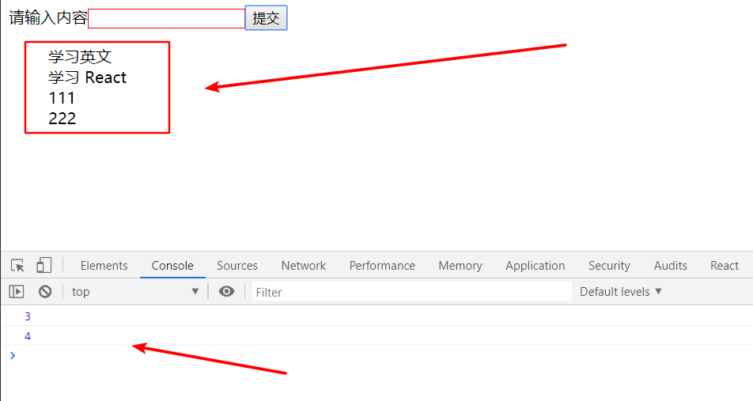
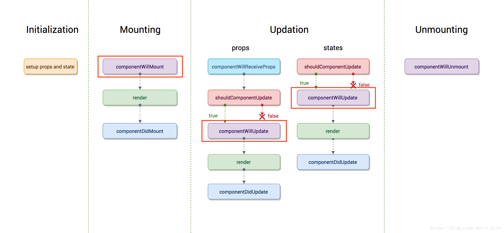
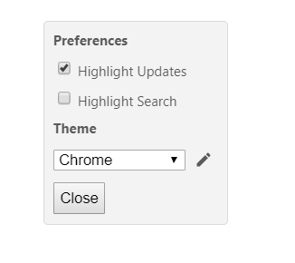
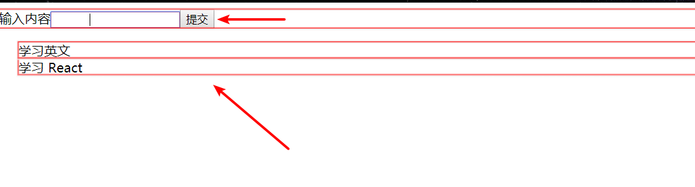
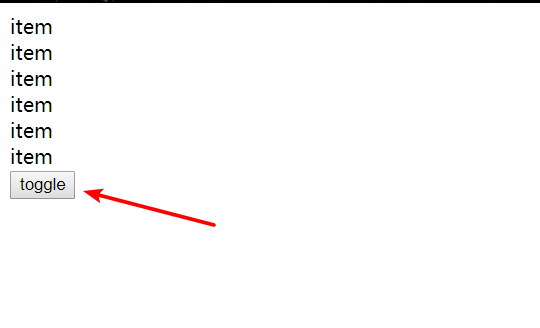

# React 入门(2)
> 【第4章】
## 安装 React 调试工具

- [React Developer Tools](https://chrome.google.com/webstore/detail/react-developer-tools/fmkadmapgofadopljbjfkapdkoienihi?utm_source=chrome-ntp-icon)
- React 开发调试方法： 打开 Chrome 开发者工具，对已安装 React 调试工具后，可以看到 React，同时，在右侧可以实时看到数据变化



## PropTypes 与 DefaultProps 的应用

- [参考文档](https://reactjs.org/docs/typechecking-with-proptypes.html)

```jsx
import React, {Component} from 'react'
import PropTypes from 'prop-types';

class TodoItem extends Component{
    {//省略部分代码}
}

TodoItem.propTypes = {
    content: PropTypes.string.isRequired,
    deleteItem: PropTypes.func,
    index: PropTypes.number
}

TodoItem.defaultProps = {
        test: 'hello, wold!',
    	xxx: 'this is a test'
    }
export default TodoItem;
```

更多内容，请看 [React 官方文档](https://reactjs.org/docs/typechecking-with-proptypes.html) ，建议看英文版，因为中文版本可能会有些滞后

## props，state，render函数之间的关系

- 当组件的 props 和 state 发生变化时， render 函数就会重新执行。因为页面是由 render 函数渲染出来的
- 当父组件的 render 被运行时，它的子组件的render函数都将被重新运行一次

## 虚拟 DOM

首先，我们来梳理下一个页面的渲染流程：

> 模拟操作，当在 input 输入内容时

### 普通版本：

1. state 数据

2. JSX 模板

3. 数据 + 模板 结合，生成真实的 DOM ，来显示

4. state 发生改变

5. 数据 + 模板 结合，生成真实的 DOM，替换原始的 DOM

**缺点：**

- 第一次生成了一个完整的 DOM 片段
- 第二次生成了一个完整的 DOM 片段
- 第二次的 DOM 替换第一次的 DOM 片段，非常消耗性能

### 改进版：

1. state 数据
2. JSX 模板
3. 数据 + 模板 结合，生成真实的 DOM ，来显示
4. state 发生改变
5. 数据 + 模板 结合，生成真实的 DOM，并不直接替换掉原始的 DOM
6. **新的 DOM（DocumentFragment） 和 原始的 DOM 作对比，找差异（消耗性能）**
7. **找出 input 框发生了变化**
8. **只用新的DOM 中的 input 元素替换掉原始 DOM 中的 input 的元素（提升性能）**

**缺陷：**

在消耗性能后又提升性能，提升并不大

### React 版本：

1. state 数据
2. JSX 模板
3. 生成虚拟的  DOM （虚拟 DOM 就是一个 JS 对象，用它来描述真实的 DOM ，消耗了性能），效果如下：

```js
['div',{id: 'abc'},['span',{},'hello world!']]
```
4. 数据 + 模板 结合，生成真实的 DOM ，来显示

```html
<div id="abc"><span>hello world!</span></div>
```
5. state 发生变化 （修改 span 中 'hello world!'  为 'bye bye'）
6. 数据 + 模板，生成一个新的虚拟 DOM （极大的提升了性能） 

```js
['div',{id: 'abc'},['span',{},'bye bye']]
```

7. 比较原始虚拟 DOM 和新的虚拟 DOM 区别（比对的是 js 对象的不同，而不是 DOM 的区别），找到区别是 span 内容（极大的提升了性能）
8. 直接操作 DOM ，改变 span 中的内容

> 说明：
>
> 第4步，看起来是消耗了性能，但是，对比使用 js 生成一个 DOM 对象，使用 js 生成一个 js 对象，性能消耗是极小的。因为 js 生成一个 DOM 对象时，调用的是浏览器 Web Application 的一个 API，性能损耗很大。


## 深入理解虚拟 DOM

JSX —— createElement——虚拟 DOM （JS对象）——真实的 DOM 

在 render 函数中，JSX 到底做了什么？

```jsx
render() {
	return (<div>item</div>);
}

{//等价于}

render() {
	return React.createElement('div',{},'item');
}

```

当代码复杂一些时：

```js
render() {
	return (<div>item</span></div>);
}

{//等价于}

render() {
	return React.createElement('div',{},React.createElement('span',{},'item'));
}

```

我们发现，当代码复杂量加大时，JSX 底层方法需要一直使用 `React.createElement()`，过于复杂。

使用 虚拟 DOM 的优点：

- 性能提升了
- 它使得跨端应用得以实现。 React Native。（对于前端而言，将虚拟 DOM 转换成浏览器可以解析的 dom 使得其可以在网页中展示出来；而在其他端上，可以将虚拟 DOM 转换成其他应用的组件）

## 虚拟 DOM 中的 Diff 算法

在前面介绍中，虚拟 DOM 渲染流程的第 7 步

> 7.比较原始虚拟 DOM 和新的虚拟 DOM 区别（比对的是 js 对象的不同，而不是 DOM 的区别），找到区别是 span 内容（极大的提升了性能）

这里，比较原始虚拟 DOM  和新的虚拟 DOM 区别，在 React 底层中，使用到的，就是 diff 算法

也就是在使用 `setState` 方法时，会调用 `diff` 算法

### diff 算法原理图：



**同层DOM比对**，当某一层的新旧 DOM 不同，则直接使用新 DOM 该层替换掉旧 DOM 中该层以下所有组件，虽然对比方法简单粗暴，但是确实是提升了性能。

### 不使用 index 作为 key 值

原因如下：




在 React 的底层 diff 算法中，其对比旧虚拟 DOM  和新虚拟 DOM 的方法，是先对旧虚拟 DOM 编号（设置key值），然后对 新的虚拟 DOM 编号。当新的虚拟 DOM 中多了一个元素时，其会为该新元素设置编号，我们假定认为是 z （也就是key值），接着对 z 所在组件进行渲染，以上，就是 diff 算法的原理。

```jsx
getTodoItem() {
        return this.state.list.map((item, index) => {
            return (
                    <TodoItem
                        key={index}
                        content={item}
                        index={index}
                        deleteItem={this.handleItemDelete}
                    />
            )
        })
    }
```

但是，此时，如果我们在代码中，设置 `key={index}` ，这个时候，React 就不能很好的识别 diff 算法设置的编号和我们设置的编号（key）值，**新旧 DOM 就无法建立起联系，就失去了 index 存在的意义了**。

再比如，我们有 3 个 `li` ，如下：

```html
<li>a</li>
<li>b</li>
<li>c</li>
```

我们自定义设置 key 值分别为 0,1,2；

```jsx
a  0
b  1
c  2
```

当删除第二个 `li` 时，此时为

```jsx
a  0
c  1
```

这个时候，我们要取出 key 为 1 的值，就不是 b 而是 c 了，这就导致一些问题了。

所以，不建议使用 `key={index}` ，而是使用 `key={item}` ，如：

```jsx
a  a
b  b
c  c
```

删除 b 后，我们取 c ，就是 c 

```jsx
a  a
c  c
```

这样，不论怎么变化，取值都是原来的值，不改变

## React 中 ref 的使用

###  不建议直接操作 DOM 

- [Ref 教程](https://zh-hans.reactjs.org/docs/refs-and-the-dom.html#___gatsby)

使用场景：

```jsx
{//旧代码：没有使用 ref 时}
render(){
        return (
            <Fragment>
                <div>
                    <label htmlFor="insertArea">请输入内容</label>
                    <input id="insertArea" type="text" className='input'
                           value={this.state.inputValue}
                           onChange={this.handleInputChange}
                    />
                    <button onClick={this.handleBtnClick}>提交</button>
                </div>
                <ul>
                    {this.getTodoItem()}
                </ul>
            </Fragment>
        )
    }
    handleInputChange(e) {
        const value = e.target.value;
        this.setState(() => ({inputValue: value}));
    }
    
{//新代码：使用 ref 时}
    
render(){
        return (
            <Fragment>
                <div>
                    <label htmlFor="insertArea">请输入内容</label>
                    <input id="insertArea" type="text" className='input'
                           value={this.state.inputValue}
                           onChange={this.handleInputChange}
                           ref={(input) => {this.input = input}}
                    />
                    <button onClick={this.handleBtnClick}>提交</button>
                </div>
                <ul>
                    {this.getTodoItem()}
                </ul>
            </Fragment>
        )
    }
    handleInputChange(e) {
        const value = this.input.value;
        this.setState(() => ({inputValue: value}));
    }
```

从代码中我们可以看出，将 `handleInputChange` 中 `e.target`  我们使用 `ref` 的方式，使用 `this.input` 直接获得了 DOM 的相关信息。

注意：但是在 React 思想中，核心是以 **数据驱动** ，并不建议直接操作 DOM 。

### 异步函数 setState 的第二个参数

虽然 React 并不建议我们直接操作 DOM 时，但是在实际开发中，我们不可避免的会遇到一些做动画的项目需求，这个时候，就要使用 ref 操作 DOM 了。

但是，在使用 ref 操作 DOM  时，我们需要注意一些问题：

比如：

```jsx
 render(){
        return (
            <Fragment>
                <div>
                    <label htmlFor="insertArea">请输入内容</label>
                    <input id="insertArea" type="text" className='input'
                           value={this.state.inputValue}
                           onChange={this.handleInputChange}
                           ref={(input) => {this.input = input}}
                    />
                    <button onClick={this.handleBtnClick}>提交</button>
                </div>
                <ul ref={(ul) => {this.ul = ul}}>
                    {this.getTodoItem()}
                </ul>
            </Fragment>
        )
    }
    handleBtnClick() {
        this.setState((prevState) => ({
            list: [...prevState.list, prevState.inputValue],
            inputValue: ''
        }));
        console.log(this.ul.querySelectorAll('div').length);
    }
```

看上述代码，我们给 `ul` 添加了 ref ，然后使用 `this.ul` 获得。

然后在下面 `handleBtnClick()` 方法中进行测试，当点击鼠标添加列表项后，打印出 `div `的长度（也就是个数），但是结果总是少一个？？？这是为什么呢？ 



原因：

这是因为 `setState` 函数是一个**异步函数**，打印 div 长度的代码虽然是写在了添加类表项后面，但是，在具体执行的时候，**却是未等 `setState` 方法执行完成就打印了 div 的长度**

那怎么办呢？

**使用 `setState` 的第二个参数，即一个回调函数 ，在 `setState ` 方法执行完成以后，该回调函数会被调用，也就是页面被渲染完成以后会被调用**

```js
 render(){
        return (
            <Fragment>
                <div>
                    <label htmlFor="insertArea">请输入内容</label>
                    <input id="insertArea" type="text" className='input'
                           value={this.state.inputValue}
                           onChange={this.handleInputChange}
                           ref={(input) => {this.input = input}}
                    />
                    <button onClick={this.handleBtnClick}>提交</button>
                </div>
                <ul ref={(ul) => {this.ul = ul}}>
                    {this.getTodoItem()}
                </ul>
            </Fragment>
        )
    }
    handleBtnClick() {
        this.setState((prevState) => ({
            list: [...prevState.list, prevState.inputValue],
            inputValue: ''
        }), () => { console.log(this.ul.querySelectorAll('div').length); });
    }
```



这样一来，我们就可以正确获取到 DOM  的真实信息啦！

更多有关 ref 的信息，请参考 [Ref 教程](<https://zh-hans.reactjs.org/docs/refs-and-the-dom.html#___gatsby>)

##  React 的生命周期函数

>  生命周期函数是指：在某一个时刻组件会自动执行的函数



### Initialization

组件初始化时执行，主要是在 `constructor` 中

```jsx
import React, {Component} from 'react'

class TodoItem extends Component{

    constructor(props) {
        super(props);
        {//初始化执行代码}
    }
}

export default TodoItem;
```

### Mounting

挂载期。

- `componentWillMount` 组件即将挂载但是未挂载
- `render` 渲染期
- `componentDidMount` 组件被挂载到页面之后，自动被执行

**需要注意**：`componentWillMount` 方法和 `componentDidMount` 只会在组件第一次被挂载时被执行

### Updation

因为更新分为 `props` 更新和 `state` 更新，我们需要分开来理解；但是，两者又有4块共同部分，我们先来理解共同部分：

- `shouldComponentUpdate` 需要被更新吗（返回布尔值 true or false），返回 false 时后面的流程都执行
- `componentWillUpdate` 组件被更新之前，它会自动执行，但是它在 `shouldComponentUpate` 执行后返回 true 才执行
- `render` 前面都执行完成了，渲染虚拟 DOM 
- ` componentDidUpdate`  组件更新完成之后被执行

接着，我们来理解 `props` 单独所有的

- `componentWillReceiveProps`  （比较复杂，需要着重理解！！）
  - 一个组件要从父组件接受参数
  - 只要父组件的 render 函数被执行了，子组件的这个生命周期函数就会被执行；
  - 换句话说，如果这个组件**第一次**存在于父组件中，不会被执行；如果这个组件**之前已经存在**父组件中，才会被执行。

### Unmounting

- `componentWillUnmount`  当这个组件即将被从页面中移除的时候，会被执行。就是在 `componentDidUpdate` 之前。

**需要注意**，在具体的例子中具体写 log 进行测试，需要说明的是，不管是父组件还是子组件，都贯穿着这些生命周期函数。

所有的生命周期函数都可以不存在，但是，**唯独 render 不可以不存在**。因为其他生命周期函数都内置了，而 render 函数没有内置，需要自己书写。


## React 生命周期函数的使用场景

### 使用 shouldComponentUpdate 进行性能优化

首先，我们设置下浏览器中 React 的控制面板



以前面我们写的 TodoList 为例

- `shouldComponentUpdate` 



前面我们学习React 的生命周期函数时我们知道，当组件发生变化重新渲染时，其子组件也会重新被渲染。

但是，如上图，我们尝试修改父组件中输入框的内容，子组件内容不变，但是子组件依然还是被重新渲染了，这就不利于性能优化。

解决办法：就要在 `shouldComponentUpdate` 中进行处理，其有 两个参数，分别为 `nextProps` 和 `nextState` 

```jsx
import React, {Component} from 'react'

class TodoItem extends Component{

    constructor(props) {
        super(props);
        this.handleClick = this.handleClick.bind(this)
    }
    
    shouldComponentUpdate(nextProps, nextState) {
        if(nextProps.content !== this.props.content) {
            return true;
        } else {
            return false;
        }
    }
    render() {
        const {content} = this.props;
        return (
            <div onClick={this.handleClick}>{content}</div>
        )
    }

    handleClick() {
        const {deleteItem, index} = this.props;
        deleteItem(index);
    }

}

export default TodoItem;
```


### 在 React 发送 Ajax 请求

错误思想：我们可能会想，数据请求在 render 渲染的时候加载合适，所以 Ajax 请求放在 render 函数中

错误代码：

```jsx
 render() {
 	    let result = {};
 	    this.ajax.then((res) =>{
 	    	result = res
 	    });
        const {content} = this.props;
        return (
            <div onClick={this.handleClick}>{content}</div>
            {result}
        )
    }
```

我们来分析 【为什么不能这么写？】

因为 render 函数会被反复执行，导致 Ajax 会重复请求。

而通常而言，Ajax 只需要获取一次就行了！

这个时候，我们会想到 【只会被执行一次的生命周期函数】

—— `componentDidMount`  和 `componentWillMount` 或者是 放在构造函数 `constructor` 中

但是，如果使用 `componentWillMount` ，考虑到后面项目开发逐渐复杂，比如写 `react native` 或者服务器端的同构时，会和一些更高端的技术产生冲突

同时，也不建议获取 Ajax 请求写在 `constructor` 中

推荐写法：写在 `componentDidMount` 中，不会有任何问题！

比如，我们使用 `axios` 进行测试：

-  `yarn add axios`
- [yarn 安装失败：No sucn file: add](https://stackoverflow.com/questions/46013544/yarn-install-command-error-no-such-file-or-directory-install/48010859)

然后，看详细代码：

```jsx
import React, { Component, Fragment} from 'react';
import TodoItem from './TodoItem';
import axios from 'axios';
import './style.css'

class TodoList extends Component{

    constructor(props){
        super(props);
        this.state = {
            inputValue: '',
            list: ['学习英文', '学习 React']
        };
       {//略...}
    }

    render(){
        return (
           {//省略部分代码...}
        )
    }
            
    componentDidMount() {
        axios.get('/api/todolist').then(() =>{
            alert('succ');
        }).catch(() => {
            alert('error');
        });
    }
}

export default TodoList;
```

效果如下：


## 使用 Charles 实现本地数据 mock

- [Charles 下载安装](https://www.axihe.com/charles/charles/download.html#windows-64)
- [Charles 注册码](https://www.axihe.com/charles/charles/free-use.html#charles-%E7%A0%B4%E8%A7%A3%E5%8E%9F%E7%90%86%E4%BA%8C-%E6%B3%A8%E5%86%8C%E7%A0%81%E8%BF%9B%E8%A1%8C%E6%B3%A8%E5%86%8C)

首先，新建 `Todolist.json` 文件，在里面写点东西：

```json
["Dell", "Lee", "Hello"]
```

然后，打开 Tools >> Map Local >> Add ，根据刚才 axios 中使用的路径来配置：


相关代码：

```jsx
import React, { Component, Fragment} from 'react';
import TodoItem from './TodoItem';
import axios from 'axios';

{// 省略部分代码}

componentDidMount() {
        axios.get('/api/todolist').then((res) =>{
            console.log(res);
            this.setState(() => {
               list: [...res.data]
            })
        }).catch(() => {alert('error')});
    }
    
    {// 省略部分代码}
```


## React 实现 CSS 过渡动画

 看代码：

```jsx
import React, { Component, Fragment } from 'react';
import './style.css';

class App extends Component {
    constructor(props) {
        super(props);
        this.state = {
            show: true
        };
        this.handleToggle = this.handleToggle.bind(this);
    }
    render() {
        return (
            <Fragment>
                <div className={this.state.show ? 'show' : 'hide'}>hello</div>
                <button onClick={this.handleToggle}>toggle</button>
            </Fragment>
        )
    }
    handleToggle() {
        this.setState({
            show: this.state.show ? false : true
        })
    }
}

export default App;
```

对应的 css 如下：

```css
.show {
    opacity: 1;
    transition: all 1s ease-in;
}

.hide {
    opacity: 0;
    transition: all 1s ease-in;
}
```


## React 中使用 CSS 的动画效果

js 代码还是和上面一样，修改 css 代码即可

```css
.show {
    opacity: 1;
    transition: all 1s ease-in;
}

.hide {
    opacity: 0;
    animation:hide-item 2s ease-in;
}

@keyframes hide-item {
	0%{
 		opacity: 1;
 		color: red;
	 }
	 50%{
	 	opacity: 0.5;
	 	color: green;
	 }
	 100%{
         opacity: 0;
         color: blue;
	 }
}
```

这样就实现了动画效果啦

但是还有一个问题，动画效果结束后它又显示了！？

我们想要的是让 item 隐藏，**即保留该动画最后一帧的样式**，难道需要单独写一个 css 样式吗？

不需要，直接使用 `forwards` 即可实现，代码如下：

```css
.hide {
    opacity: 0;
    animation:hide-item 2s ease-in forwards;
}
```


## React-transition-group 的使用

>  [React-transition-group安装](https://reactcommunity.org/react-transition-group/)

### CSSTransition 的使用

- [CSSTransition学习教程](https://reactcommunity.org/react-transition-group/css-transition)

代码如下：

```jsx
import React, { Component, Fragment } from 'react';
import { CSSTransition } from 'react-transition-group';
import './style.css';

class App extends Component {
    constructor(props) {
        super(props);
        this.state = {
            show: true
        };
        this.handleToggle = this.handleToggle.bind(this);
    }
    render() {
        return (
            <Fragment>
                <CSSTransition
                    in={this.state.show}
                    timeout={1000}
                    classNames='fades'
                    unmountOnExit
                    onEnter={(el) => {el.style.color='blue'}}
                >
                    <div className={this.state.show ? 'show' : 'hide'}>hello</div>
                </CSSTransition>
                <button onClick={this.handleToggle}>toggle</button>
            </Fragment>
        )
    }
    handleToggle() {
        this.setState({
            show: this.state.show ? false : true
        })
    }
}

export default App;
```

CSS 代码为：

```css
.fade-enter, .fade-appear{ //动画进入前效果
    opacity: 0;
}
.fade-enter-active, .fade-appear-active{ //动画进入时效果
    opacity: 1;
    transition: opacity 1s ease-in;
}
.fade-enter-done{ //动画进入后效果
    opacity: 1;
}

.fade-exit{ //动画退出前效果
    opacity: 1;
}
.fade-exit-active { //动画退出时效果
    opacity: 0;
    transition: opacity 1s ease-in;
}
.fade-exit-done {  //动画退出后效果
    opacity: 0;
}

```


其中，需要着重说明：

```jsx
 <CSSTransition
     in={this.state.show}
     timeout={1000}
     classNames='fades'
     unmountOnExit
     onEnter={(el) => {el.style.color='blue'}}
     appear={true}
     >
	 <div className={this.state.show ? 'show' : 'hide'}>hello</div>
 </CSSTransition>
```

- `unmountOnExit` 表示在 toggle 以后，显示后逐渐隐藏的 div 在完成过渡效果后**消失** 
- `onEnter` 钩子。即在有需要时或者说仅仅使用 css 过渡实现不了过渡效果时，辅助 js 的方式添加过渡效果，上述代码中使用 js 的方式给过渡元素添加颜色为蓝色。当然， CSS Transition还提供了其他钩子，如 `onEntering` ，`onEntered` ， `onExit` 等，我们需要特别注意这些**钩子的执行时间**。
- `className="fade"` 当 class 名字设置成什么，对应的 CSS 样式就是 `.fade-enter` 或 `.fade-exit` 等，名字需要一一对应！
- `appear={true}` 属性，即当你想要**页面一开始加载的时候就有该动画效果**，设置该属性为 true ，同时在 CSS 代码中添加 `.fade-appear` 等即可实现。

**需要注意：**当使用 `CSSTransition` 满足不了我们的动画需求时，我们可以看看 [transition](http://reactcommunity.org/react-transition-group/transition) ，这里可以找到对应的方法


### TransitionGroup 的使用

- [transition-group 教程](http://reactcommunity.org/react-transition-group/transition-group)

应用场景：当多个 DOM 需要做同样的动画时使用。

需求：点击按钮新增同样的 item ，同时，每一个新增的 item 都有同样的动画效果。

JS 代码如下：

```jsx
import React, { Component, Fragment } from 'react';
import { CSSTransition } from 'react-transition-group';
import './style.css';

class App extends Component {
    constructor(props) {
        super(props);
        this.state = {
            list: []
        };
        this.addItem = this.addItem.bind(this);
    }
    render() {
        return (
            <Fragment>
                {
                    this.state.list.map( (item, index) => {
                        return (<div key={index}>{item}</div>)
                    })
                }
                <button onClick={this.addItem}>toggle</button>
            </Fragment>
        )
    }
    addItem() {
        this.setState((prevState) => {
            return {
                list: [...prevState.list, 'item']
            }
        })
    }
}
```

效果如下：



需求：每次点击按钮新增 item 都会有同样的动画效果

```jsx
import React, { Component, Fragment } from 'react';
import { CSSTransition, TransitionGroup } from 'react-transition-group';
import './style.css';


class App extends Component {
    constructor(props) {
        super(props);
        this.state = {
            list: []
        };
        this.addItem = this.addItem.bind(this);
    }
    render() {
        return (
                <Fragment>
                    <TransitionGroup>
                        {
                            this.state.list.map( (item, index) => {
                                return (
                                    <CSSTransition
                                        timeout={1000}
                                        classNames="fade"
                                        unmountOnExit
                                        onEntered={(el) => {el.style.color='blue'}}
                                        key={index}
                                        appear={true}
                                    >
                                        <div>{item}</div>
                                    </CSSTransition>
                                )
                            })
                        }
                        <button onClick={this.addItem}>toggle</button>
                    </TransitionGroup>
                </Fragment>
        )
    }
    addItem() {
        this.setState((prevState) => {
            return {
                list: [...prevState.list, 'item']
            }
        })
        console.log(this.state.list);
    }
}

export default App;
```

对于原来 `CSSTransition` 里面的属性，只需要将 `in={this.state.show}` 删除即可，其他不需要改变

将需要做动画效果的单个组件包裹在 `CSSTransition` 里面，然后在其外侧包裹 `TransitionGroup` 就可以实现啦。

**注意：对于 `key={index}` 需要放在第一个外层元素上** ，而不是原来的 `<div key={index}>{item}</div>` 上


### 小结：

在日常开发中，通常需要将 `CSSTransition` 和 `TransitionGroup` 结合使用，当我们发现使用 `TransitionGroup` 无法满足需求时，我们可以看看 `CSSTransition` 的API，通常可以找到我们想要的答案。


