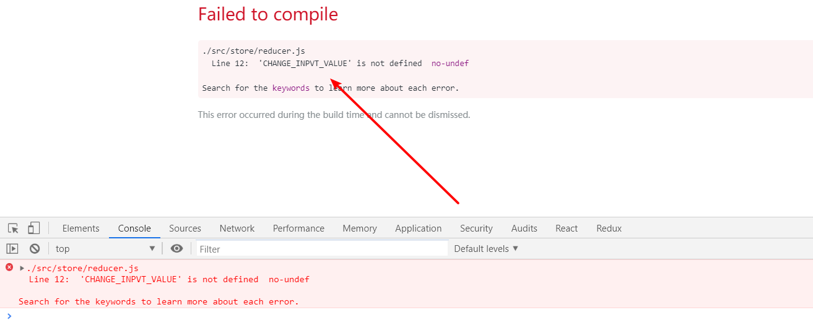

# React 入门(3)——Redux 学习

## React 的不足

前面我们学习过 React 的父子通信的知识，我们知道，当最顶层的父元素想要获得最底层子元素的数据时，需要子元素一级一级往上传，这样显得很麻烦很累赘，代码也会显得很恶心，这也更加加深了我们对 React 只是一个轻量型的 UI 框架。

为了解决这种问题，我们引出今天的主角—— Redux

Redux 是什么？

我们可以简单的认为它是一个数据管理中心 Store，有了它，每一个组件都可以将数据进行变更，然后每个组件都从 Store 中取数据，这样就避免了原先子元素需要一级一级往上传递数据给父元素的不足。


Redux 的历史

Redux = Reducer + Flux 

React 在 2013 年开源的时候，也开源了辅助 React 的工具 Flux，进行数据管理，因为 Flux 自身存在了一些不足，因此有人将其升级成了 Redux

## 了解 Redux

- [Redux 官网](https://redux.js.org/)
- [Redux 中文网](https://www.redux.org.cn/)


以上，是 Redux 的工作流程表，为了更好理解，我们做个比喻：

- React Components：借书人
- Action Creators：借书人说的话（要借什么东西）
- Store：图书管理员
- Reducers：图书管理员的记录本（图书清单，名字以及分类和所在位置等）

具体流程为：

借书人要借一本书，他找到图书管理员，图书管理员对照记录本，查看是否有这本书，查找其在哪一个位置等信息，找到这本书后，管理员将该书给到借书人。

代码理解：

- 获取数据

首先，我们有一个组件，这个组件要获取 Store 中的数据（Action Creatures），它告诉 Store ，Store 并不知道组件需要的是什么类型的数据，它需要去问一下 Reducer，Reducer 知道该给组件什么数据。Reducer 将数据给到 Store，然后 store 给组件就可以了

- 改变数据

首先，组件通过 Action Creatures 告诉 Store 需要修改数据，Store 不知道组件需要怎样修改数据，它告诉 Reducers ，Reducers 将数据给到 Store ，然后 Store 对数据进行修改。

## 使用 AnTd 实现 Todolist 的布局

- [AntDesign 官网](https://ant.design/index-cn)
- 安装 AntD： `yarn add antd`

放入输入框，按钮，列表：

```jsx
import React, { Component } from 'react';
import 'antd/dist/antd.css';
import { Input, Button, List } from 'antd';

const data = [
    'Racing car sprays burning fuel into crowd.',
    'Japanese princess to wed commoner.',
    'Australian walks 100km after outback crash.',
    'Man charged over missing wedding girl.',
    'Los Angeles battles huge wildfires.',
];

class MyTodo extends Component{

    render() {
        return (
            <div style={{marginLeft: '10px', marginTop: '10px'}}>
                <div>
                    <Input placeholder="todo info" style={{width: '300px', marginRight: '10px'}}/>
                    <Button type="primary">提交</Button>
                </div>
                <List
                    style={{marginTop: '10px', width: '300px'}}
                    header={<div>Header</div>}
                    footer={<div>Footer</div>}
                    bordered
                    dataSource={data}
                    renderItem={item => (
                        <List.Item>
                            {item}
                        </List.Item>
                    )}
                />
            </div>
        );
    }
}

export default MyTodo;
```


对于 AntD 的学习，和学习 BootStrap 方法相似，仔细阅读文档，copy 对应代码调试即可。

需要说明几个注意要点：

- AntD 组件在使用前需要引入，然后使用时**首字母要大写**
- AntD 组件使用内联的方式表示样式，需要使用 `style={{xxxAAA: '20px'}}`  的形式


## 创建 Redux 中的 store

在使用 Redux 之前，需要安装 Redux： `yarn add redux` 

### 创建公共数据存储仓库

首先，创建文件夹 store，在其里面创建文件 `index.js` ，代码如下：

```jsx
import createStore from 'redux';

const store = createStore();

export default store;
```

上面的操作，形象的比喻为创建一个图书管理员，而图书管理员要管理书籍信息，还需要一个“笔记本”（图书清单）


### 创建 Reducer  笔记本

在 store 文件夹下创建文件 `reducer.js` 文件

然后，我们把数据写进去：

```jsx
const defaultState = {
    inputValue: 'redux test info',
    list: ['hello', 'world']
};
export default (state = defaultState, action) => {
	return state;
}
```

说明下 state 

- state: 比喻为整个图书馆里所有书籍的信息，也可以认为是**公共数据存储仓库的数据**
- reducer 返回的必须是一个函数！上面代码中我们返回了一个匿名函数。

### 把笔记本放在仓库里（管理员手上）

准备好了 store 和 reducer 以后，将 reducer 放进 store 里

```jsx
import { createStore } from 'redux';
import reducer from './reducer';

const store = createStore(reducer);

export default store;

```

这个时候，store 就有数据了~

现在，我们可以把原来 todolist 中的数据换成 store 的数据了，步骤如下：

- 引入 store 后，使用 `getState()` 方法获取 state 中的数据，在 constructor 中完成初始化 state

- 在 `Input` 中设置 `value` 值为 `this.state.inputValue` 

- 在 `dataSource` 中设置 `dataSource={this.state.list}` 

  

详细代码如下：

```jsx
import React, { Component } from 'react';
import 'antd/dist/antd.css';
import { Input, Button, List } from 'antd';
import store from './store/index';

class MyTodo extends Component{

    constructor(props) {
        super(props);
        this.state = store.getState();
    }

    render() {
        return (
            <div style={{marginLeft: '10px', marginTop: '10px'}}>
                <div>
                    <Input value={this.state.inputValue} placeholder="todo info" style={{width: '300px', marginRight: '10px'}}/>
                    <Button type="primary">提交</Button>
                </div>
                <List
                    style={{marginTop: '10px', width: '300px'}}
                    header={<div>Header</div>}
                    footer={<div>Footer</div>}
                    bordered
                    dataSource={this.state.list}
                    renderItem={item => (
                        <List.Item>
                            {item}
                        </List.Item>
                    )}
                />
            </div>
        );
    }
}

export default MyTodo;
```

效果为：


## Action 和 Reducer 的编写

编写之前，我们需要安装一个 Chrome 插件 [Redux-devTools](https://chrome.google.com/webstore/detail/redux-devtools/lmhkpmbekcpmknklioeibfkpmmfibljd?utm_source=chrome-ntp-icon)

然后，我们打开 Chrome 开发者工具，对插件进行一些配置，点击该 [链接](https://github.com/zalmoxisus/redux-devtools-extension#usage)


在该链接中，把如下代码放进 `./store/index.js` 中


代码为：

```jsx
import { createStore } from 'redux';
import reducer from './reducer';

const store = createStore(
    reducer, 
    window.__REDUX_DEVTOOLS_EXTENSION__ && window.__REDUX_DEVTOOLS_EXTENSION__()
);

export default store;
```

这个时候，我们再次打开面板：


我们就可以看到相关信息了

前面，我们学习了组件如何从 store 获取数据的方法，下面，我们来介绍**组件改变 store 数据，同时同步更新的方法。**

需求：当从 input 输入内容时，我们要改变 store 的数据，为此，我们需要先设置 action。

```jsx
import React, { Component } from 'react';
import 'antd/dist/antd.css';
import { Input, Button, List } from 'antd';
import store from './store/index';


class MyTodo extends Component{
    constructor(props) {
        super(props);
        this.state = store.getState();
        this.handleInputChange = this.handleInputChange.bind(this);
    }

    render() {
        return (
            <div style={{marginLeft: '10px', marginTop: '10px'}}>
                <div>
                    <Input
                        value={this.state.inputValue}
                        placeholder="todo info"
                        style={{width: '300px', marginRight: '10px'}}
                        onChange={this.handleInputChange}
                    />
                    <Button type="primary">提交</Button>
                </div>
                <List
                    style={{marginTop: '10px', width: '300px'}}
                    header={<div>Header</div>}
                    footer={<div>Footer</div>}
                    bordered
                    dataSource={this.state.list}
                    renderItem={item => (
                        <List.Item>
                            {item}
                        </List.Item>
                    )}
                />
            </div>
        );
    }
    handleInputChange(e) {
        const action = {
            type: 'change_input_value',
            value: e.target.value
        }
        store.dispatch(action);
    }

}

export default MyTodo;
```

核心代码：

```js
 <Input
     value={this.state.inputValue}
     placeholder="todo info"
     style={{width: '300px', marginRight: '10px'}}
     onChange={this.handleInputChange}
     />
      
      
handleInputChange(e) {
        const action = {
            type: 'change_input_value',
            value: e.target.value
        }
        store.dispatch(action);
    }
```

主要说明：

- `const action` 是定义一个 action 对象，type 表示这个 action 做什么事（描述动作），value 表示设置 value 的值为输入框中的值
- `store.dispatch(action)` 既然动作已经描述完成了（要修改数据的动作设置完成），接下来就要告诉 store 进行 action 的设置了，方式为通过 `dispatch()` 方法将组件的 action 提交给 store

接下来，数据管理员（store）要进行数据修改，但是它不知道怎么修改，所以它将现存的数据 `previousState` 和 前面组件提交过来的 `action`  **自动转发给** `reducer` 

此时，`reducer` 接收到数据和 action 以后，对数据进行处理，然后给 store 返回一个新的 `state`

这个时候，我们来看 `reducer.js` 的代码就很容易理解了：

```jsx
const defaultState = {
    inputValue: 'redux test info',
    list: ['hello', 'world']
};


// reducer 可以接收 state ，但是绝不能修改 state
export default (state =defaultState, action) => {
    if (action.type === 'change_input_value') {
        const newState = JSON.parse(JSON.stringify(state)); //深拷贝
        newState.inputValue = action.value;
        return newState;
    }
    return state;
}
```


此时，我们可以在 input 中输入字符，然后打开 Chrome 控制台 Redux 调试工具中 state 进行查看，是否在输入内容的时候该 state 的数据会实时更新。

以上，我们完成了 action，store ，reducer 的相关代码编写，也实现了提交 action 时 store 中数据跟随改变，最后一步，就是将改变后的数据渲染到 页面中。

步骤分为三步：

- 使用 `store.subscribe()` 的方式订阅 store 进行数据同步
- 自定义函数 `this.handleStateChange` ，设置更新后的数据

代码如下：

```jsx
import React, { Component } from 'react';
import 'antd/dist/antd.css';
import { Input, Button, List } from 'antd';
import store from './store/index';


class MyTodo extends Component{

    constructor(props) {
        super(props);
        this.state = store.getState();
        this.handleInputChange = this.handleInputChange.bind(this);
        this.handleStateChante = this.handleStateChante.bind(this);
        store.subscribe(this.handleStateChante);
    }

    render() {
        return (
            <div style={{marginLeft: '10px', marginTop: '10px'}}>
                <div>
                    <Input
                        value={this.state.inputValue}
                        placeholder="todo info"
                        style={{width: '300px', marginRight: '10px'}}
                        onChange={this.handleInputChange}
                    />
                    <Button type="primary">提交</Button>
                </div>
                <List
                    style={{marginTop: '10px', width: '300px'}}
                    header={<div>Header</div>}
                    footer={<div>Footer</div>}
                    bordered
                    dataSource={this.state.list}
                    renderItem={item => (
                        <List.Item>
                            {item}
                        </List.Item>
                    )}
                />
            </div>
        );
    }
    handleInputChange(e) {
        const action = {
            type: 'change_input_value',
            value: e.target.value
        }
        store.dispatch(action);
    }
    
    handleStateChante() {
        this.setState(store.getState());
    }
}

export default MyTodo;
```

这样一来，我们就实现了输入的数据和 store 的数据进行联动。

接着，我们继续编写 【点击按钮后将输入框中内容添加到 todoitem 中】，我们再走一遍上面的流程。

1. 在 `MyToDo.js` 中添加点击事件，编写 action ，然后将 action 派发 (dispatch) 到 store 中，核心代码如下：

```jsx
 constructor(props) {
        super(props);
        this.state = store.getState();
        this.handleBtnClick = this.handleBtnClick.bind(this);
        store.subscribe(this.handleStateChange);
    }
 
 <Button type="primary" onClick={this.handleBtnClick}>提交</Button>
 
 handleBtnClick() {
        const action = {
            type: 'add_todo_item'
        }
        store.dispatch(action);
    }
```

2. 在 store 中，store 会将派发过来的 action 自动转发给 reducer
3. 在 reducer 中，编写相关代码，修改 state，然后返回给 store

```jsx
const defaultState = {
    inputValue: 'redux test info',
    list: ['hello', 'world']
};

// reducer 可以接收 state ，但是绝不能修改 state
export default (state =defaultState, action) => {
    if (action.type === 'change_input_value') {
        const newState = JSON.parse(JSON.stringify(state)); //深拷贝
        newState.inputValue = action.value;
        return newState; //该数据返回给到 store 了
    }
    if (action.type === 'add_todo_item') {
        const newState = JSON.parse(JSON.stringify(state)); //深拷贝
        newState.list.push(newState.inputValue);
        newState.inputValue = '';
        return newState;  //该数据返回给到 store 了
    }
    return state;
}
```

4. 在 `index.js` 中，使用 `store.subscribe()` 从 reducer 中更新后给 store 的 state ，核心代码如下：

```jsx
constructor(props) {
        super(props);
        store.subscribe(this.handleStateChange);
    }
    
 handleStateChange() {
        this.setState(store.getState());
    }
```

此时，我们打开 redux devTools 工具，进行调试就可以看到变更后的 state 的数据啦


## 使用 Redux 完成 TodoList 的删除功能

这一次，我们以编写 TodoList  删除功能的方式来再梳理一下 Redux 的流程

1. 给 todoitem 添加事件，出发删除 item 的 action，然后派发（dispatch） 给 store

```jsx
import React, { Component } from 'react';
import 'antd/dist/antd.css';
import { Input, Button, List } from 'antd';
import store from './store/index';


class MyTodo extends Component{

    constructor(props) {
        super(props);
        this.state = store.getState();
        this.handleDeleteItem = this.handleDeleteItem.bind(this);
        store.subscribe(this.handleStateChange);
    }

    render() {
        return (
            <div style={{marginLeft: '10px', marginTop: '10px'}}>
                <div>
                    <Input
                        value={this.state.inputValue}
                        placeholder="todo info"
                        style={{width: '300px', marginRight: '10px'}}
                        onChange={this.handleInputChange}
                    />
                    <Button type="primary" onClick={this.handleBtnClick}>提交</Button>
                </div>
                <List
                    style={{marginTop: '10px', width: '300px'}}
                    bordered
                    dataSource={this.state.list}
                    renderItem={(item, index) => (
                        <List.Item key={index} onClick={this.handleDeleteItem}>
                            {item}
                        </List.Item>
                    )}
                />
            </div>
        );
    }

    handleDeleteItem (index) {
        const action = {
            type: 'delete_todo_item',
            index
        }
        store.dispatch(action);
    }
}

export default MyTodo;
```

2. store 将派发过来的 action 自动转发给 reducer ，下面，我们需要编写 reducer 来修改数据，然后返回 state 给 store

```js
const defaultState = {
    inputValue: 'redux test info',
    list: ['hello', 'world']
};


// reducer 可以接收 state ，但是绝不能修改 state
export default (state =defaultState, action) => {
    if (action.type === 'delete_todo_item') {
        const newState = JSON.parse(JSON.stringify(state)); //深拷贝
        newState.list.splice(action.index, 1);
        return newState;  //该数据返回给到 store 了
    }
    return state;
}
```

3. 在 `MyToDo.js` 文件中，我们要从 store 获得修改后的数据

```jsx
import React, { Component } from 'react';
import 'antd/dist/antd.css';
import { Input, Button, List } from 'antd';
import store from './store/index';


class MyTodo extends Component{

    constructor(props) {
        super(props);
        store.subscribe(this.handleStateChange); // 获得 store 中修改后的数据
    }

    render() {
        return (
            <div style={{marginLeft: '10px', marginTop: '10px'}}>
                <div>
                    <Input
                        value={this.state.inputValue}
                        placeholder="todo info"
                        style={{width: '300px', marginRight: '10px'}}
                        onChange={this.handleInputChange}
                    />
                    <Button type="primary" onClick={this.handleBtnClick}>提交</Button>
                </div>
                <List
                    style={{marginTop: '10px', width: '300px'}}
                    bordered
                    dataSource={this.state.list}
                    renderItem={(item, index) => (
                        <List.Item key={index} onClick={this.handleDeleteItem}>
                            {item}
                        </List.Item>
                    )}
                />
            </div>
        );
    }
   
    handleStateChange() {
        this.setState(store.getState()); //获得 store 中修改后的数据
    }
}

export default MyTodo;
```

这样一来，就大功告成啦~


## ActionTypes 的拆分

翻车场景再现：

在 `MyToDo.js`  中编写 action 时，代码为：

```js
handleInputChange(e) {
        const action = {
            type: 'change_inpvt_value',
            value: e.target.value
        }
        store.dispatch(action);
    }
```

然后，在 `reducer.js` 文件中，我们写成了

```jsx
export default (state = defaultState, action) => {
    if (action.type === 'change_input_value') {
            const newState = JSON.parse(JSON.stringify(state)); //深拷贝
            newState.inputValue = action.value;
            return newState; //该数据返回给到 store 了
        }
}
```

此时，我们再浏览器中发现，测试有问题，但是 Chrome 中 Redux devTools 工具中又没有显示报错信息，这是什么原因呢？

因为粗心：`change_inpvt_value` 和 `change_input_value`  拼写错误

这种情况，在我们写代码中经常出现，即某个方法的名字拼写错误导致 bug ，但是没有报错信息找 bug 很蛋疼！！这可怎么办？

使用 ActionTypes!!!

```jsx
export const CHANGE_INPUT_VALUE = 'change_input_value';
export const ADD_TODO_ITEM = 'add_todo_item';
export const DELETE_TODO_ITEM = 'delete_todo_item';

```

然后，分别在 `MyTodo.js` 和 `reducer.js` 文件中引入 `actionType.js` ，接着将原来的 action 中的 type 换成上面的即可

```js
import React, { Component } from 'react';
import 'antd/dist/antd.css';
import { Input, Button, List } from 'antd';
import store from './store/index';
import {CHANGE_INPUT_VALUE, ADD_TODO_ITEM, DELETE_TODO_ITEM} from './store/actionTypes';


class MyTodo extends Component{

    constructor(props) {
       // ...
    }

    render() {
        // ...
    }
    
    handleInputChange(e) {
        const action = {
            type: CHANGE_INPUT_VALUE,
            value: e.target.value
        }
        store.dispatch(action);
    }

    handleStateChange() {
        this.setState(store.getState());
    }

    handleBtnClick() {
        const action = {
            type: ADD_TODO_ITEM
        }
        store.dispatch(action);
    }
    handleDeleteItem (index) {
        const action = {
            type: DELETE_TODO_ITEM,
            index
        }
        store.dispatch(action);
    }
}

export default MyTodo;
```

`reducer.js` 文件

 ```js
import {CHANGE_INPUT_VALUE, ADD_TODO_ITEM, DELETE_TODO_ITEM} from './actionTypes';


const defaultState = {
    inputValue: 'redux test info',
    list: ['hello', 'world']
};


// reducer 可以接收 state ，但是绝不能修改 state
export default (state =defaultState, action) => {
    if (action.type === CHANGE_INPUT_VALUE) {
       // ...
    }
    if (action.type === ADD_TODO_ITEM) {
       // ...
    }
    if (action.type === DELETE_TODO_ITEM) {
        // ...
    }
    return state;
}
 ```

这样，我们就完成了对 ActionTypes的拆分，虽然，这种方式新增了一个文件，而且对于代码逻辑也不太好找，但是它却有一个很大好处。

当我们把 MyTodo.js 文件中的 Action 的 Types 拼写错了的时候

```js
if (action.type === CHANGE_INPVT_VALUE) {
      // ...
    }
```

浏览器报错情况如下：




## 使用 ActionCreator 统一创建 action

前面 `MyTodo.js` 中，我们使用如下方式创建 action ，虽然功能可以实现，但是却是不符合代码规范的：

```js
handleInputChange(e) {
        const action = {
            type: CHANGE_INPUT_VALUE,
            value: e.target.value
        }
        store.dispatch(action);
    }
```

所有 action ，应该统一进行管理，编写 `ActionCreator.js` 为

```js
import {CHANGE_INPUT_VALUE, ADD_TODO_ITEM, DELETE_TODO_ITEM} from './actionTypes';

export const getInputChangeAction = (value) => ({
    type: CHANGE_INPUT_VALUE,
    value
})
export const getAddItemAction =() => ({
    type: ADD_TODO_ITEM
})
export const getDeleteItemAction = (index) => ({
    type: DELETE_TODO_ITEM,
    index
})
```

然后，在 `MyTodo.js` 中使用为：

```jsx
import React, { Component } from 'react';
import 'antd/dist/antd.css';
import { Input, Button, List } from 'antd';
import store from './store/index';
import {getInputChangeAction, getAddItemAction, getDeleteItemAction} from './store/actionCreators';

class MyTodo extends Component{

    constructor(props) {
       // ...
    }

    render() {
        return (
           // ...
		)
    }
    handleInputChange(e) {
        const action =getInputChangeAction(e.target.value);
        store.dispatch(action);
    }

    handleStateChange() {
        this.setState(store.getState());
    }

    handleBtnClick() {
        const action = getAddItemAction();
        store.dispatch(action);
    }
    handleDeleteItem (index) {
        const action = getDeleteItemAction(index);
        store.dispatch(action);
    }
}

export default MyTodo;
```


## Redux 知识点梳理

### store 是唯一的

即整个应用中，只有一个 store，在目录 `store/index.js` 文件中，代码为：

```js
import { createStore } from 'redux';
import reducer from './reducer';

const store = createStore(reducer, window.__REDUX_DEVTOOLS_EXTENSION__ && window.__REDUX_DEVTOOLS_EXTENSION__());

export default store;
```


### 只有 store 可以改变自己的内容

前面编写代码中，我们发现，我们修改 state 数据的方法都写在了 `reducer.js` 中，我们很可能**错误的认为是 reducer 对state 数据进行了修改变更**，实际上并不是。

reducer 不能直接修改 state 的数据，这通过前面我们写的代码可以发现：

```js
import {CHANGE_INPUT_VALUE, ADD_TODO_ITEM, DELETE_TODO_ITEM} from './actionTypes';

const defaultState = {
    inputValue: 'redux test info',
    list: ['hello', 'world']
};

export default (state =defaultState, action) => {	
    if (action.type === CHANGE_INPUT_VALUE) {
            const newState = JSON.parse(JSON.stringify(state)); //深拷贝
            newState.inputValue = action.value;
            return newState; //该数据返回给到 store 了
        }
    // ...
}

// 错误写法：
export default (state =defaultState, action) => {	
    if (action.type === CHANGE_INPUT_VALUE) {
            const newState = 'xxx'
            return newState; //该数据返回给到 store 了
        }
    // ...
}
```

reducer 先是将 state 深拷贝出一份，然后在拷贝的数据进行修改，接着，就直接返回该拷贝的数据。

最后，是在 store 中对 state 数据进行了修改。

### reducer 必须是纯函数

> 纯函数：给定固定的输入，就一定会有固定的输出，而且不会有任何副作用

固定的输出——要求

- 不能含有时间的操作
- 不能含有异步的操作
- 不能含有Ajax 的操作

不会有副作用——要求

- 不能对原数据进行修改

### Redux 的核心 API

- `createStore `创建 store 
- `store.dispatch` 派发 action，将 action 传递给 store
- `store.getState()` 获取 store 中所有数据内容
- `store.subscribe()` 订阅 store 的改变，只要 store 的数据发生改变，`store.subscribe()` 中的回调函数就会被执行


