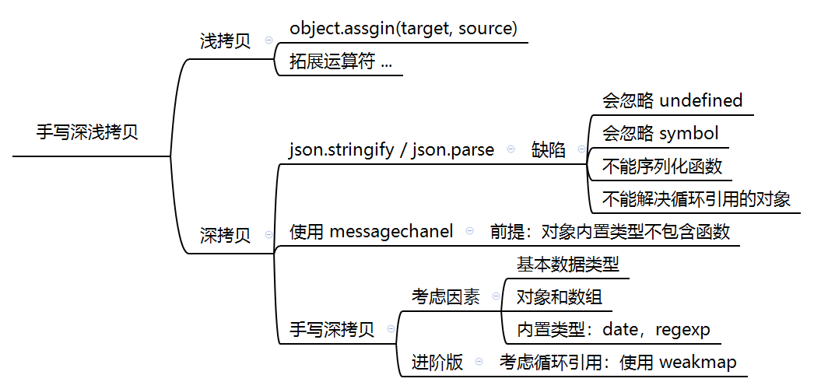

# 手写深拷贝

	

## 浅拷贝

- 使用 `Object.assign(target, source)`

```js
let a = {
    age: 1
}
let b = Object.assign({}, a)
a.age = 2
console.log(b.age) // 1
```

- 使用展开运算符 `...`

```js
let a = {
    age: 1
}
let b = { ...a }
a.age = 2
console.log(b.age) // 1
```


## 深拷贝

- 使用 `JSON.stringify(obj) / JSON.parse(str)`， 具体原理参考 [JSON-MDN](https://developer.mozilla.org/zh-CN/docs/Web/JavaScript/Reference/Global_Objects/JSON)

```js
let a = {
    age: 1,
    jobs: {
        first: 'FE'
    }
}
let b = JSON.parse(JSON.stringify(a))
a.jobs.first = 'native'
console.log(b.jobs.first) // FE
```

但是该方法也是有局限性：

- 会忽略  undefined
- 会忽略  symbol
- 不能序列化函数
- 不能解决循环引用的对象

以下代码会报错：

```js
let obj = {
    a: 1,
    b: {
        c: 2,
        d: 3,
    },
}
obj.c = obj.b
obj.e = obj.a
obj.b.c = obj.c
obj.b.d = obj.b
obj.b.e = obj.b.c
let newObj = JSON.parse(JSON.stringify(obj))
console.log(newObj)
```

这里包含循环引用对象，无法实现深拷贝。


- 若对象内置类型不包含函数，可以使用 `MessageChanel`

```js
function structuralClone(obj) {
    return new Promise(resolve => {
        const { port1, port2 } = new MessageChannel()
        port2.onmessage = ev => resolve(ev.data)
        port1.postMessage(obj)
    })
}
var obj = {
    a: 1,
    b: {
        c: 2
    }
}
obj.b.d = obj.b
// 注意该方法是异步的
// 可以处理 undefined 和循环引用对象
const test = async () => {
    const clone = await structuralClone(obj)
    console.log(clone)
}
test()
```


- 完整版本
  - 考虑基本数据类型
  - 考虑复杂对象类型
    - 数组
    - 对象
    - 内置对象：`Date, RegExp`

此时代码为：

```js

function clone (obj) {
    if (obj == null) return obj
    if (obj instanceof Date) return new Date(obj)
    if (obj instanceof RegExp) return new RegExp(obj)

    // 可能是对象或者普通的值，若为函数，则不需要深拷贝
    if (typeof obj !== 'object') return obj

    let cloneObj = new obj.constructor
    for (let k in obj) {
        if (obj.hasOwnProperty(k)) {
            cloneObj[k] = obj[k]
        }
    }
    return cloneObj
}

let obj = { name: 1, date: new Date(), reg: new RegExp("\\w+"), address: {x: 1000} }
let d = clone(obj)
console.log('obj', obj)
console.log('d', d)
console.log('obj === d', obj === d)
```


- 处理循环引用
  - 使用 WeakMap

```js
function deepClone(obj, hash = new WeakMap()) {
    if (obj == null) return obj
    if (obj instanceof Date) return new Date(obj)
    if (obj instanceof RegExp) return new RegExp(obj)
    
    // 可能是对象或者普通的值，若为函数，则不需要深拷贝
    if (typeof obj !== 'object') return obj
    // 若为对象，则进行深拷贝
    if (hash.get(obj)) return hash.get(obj)
    // [], {} , Object.prototype.toString.call(obj) === '[Object Array]' ? [] : {}
    let cloneObj = new obj.constructor
    hash.set(obj, cloneObj)

    for (let k in obj) {
        if (obj.hasOwnProperty(k)) {
            // 递归拷贝
            cloneObj[k] = deepClone(obj[k], hash)
        }
    }
    return cloneObj
}

let obj = {name: 1, address: {x: 100}}
obj.o = obj

let d = deepClone(obj)
obj.address.x = 300
console.log('d', d)
console.log('obj', obj)
console.log('obj === d', obj === d)
// 若对象复杂一些，循环引用
```

