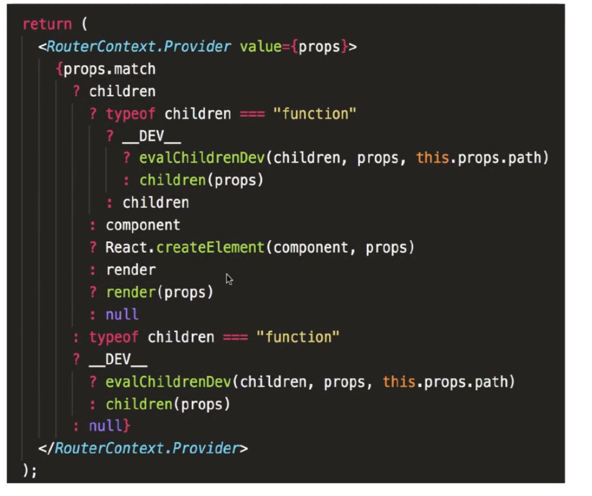

# 快速开始


```bash
npx create-react-app router-demo
cd router-demo
yarn start
```


## 配置 less 装饰器

```bash
yarn add @craco/craco craco-less @babel/plugin-proposal-decorators
```

根目录添加 `craco.config.js` 文件

```js
const CracoLessPlugin = require('craco-less')
module.exports = {
    babel: {
        plugins: [['@babel/plugin-proposal-decorators', {legacy: true}]]
    },
    plugins: [
        {
            plugin: CracoLessPlugin
        }
    ]
}
```

修改 `package.json` 文件

```json
"scripts": {
    "start": 'craco start',
    "build": "craco build",
    "test": "craco test"
}
```

启动：

```bash
yarn start
```

## React-Router 安装和使用

- 安装：

```bash
yarn add react-router-dom
```

- broswerRouter 和 hashRouter 对比

Browser router与 Hash Router对比

1. Hash Router最简单，不需要服务器端渲染，靠浏览器的＃的来区分path就可以， Browser Router

需要服务器端对不同的URL返回不同的HTML，后端配置可[参考](https://react-guide.github.io/react-router-cn/docs/guides/basics/Histories.html)。

2. Browser Router使用 HTML5 history API（ push State， replace State和 popstate事件），让页

面的U同步与URL。

3. Hash router.不支持 ocation. key和 location state，动态路由跳转需要通过？传递参数。

4. Hash history不需要服务器任何配置就可以运行，如果你刚刚入门，那就使用它吧。但是我们不

推荐在实际线上环境中用到它，因为每一个web应用都应该渴望使用 browserHistory。

- Memory Router

把URL的历史记录保存在內存中的< Router>（不读取、不写入地址栏）。在测试和非浏览器环境

中很有用，如 React Native。

建议使用 `Broswer Router`

- 简单使用，更改 `App.jsx` 页面

```jsx
import { BrowserRouter as Router, Route, Link } from 'react-router-dom'
import Home from './views/Home'
import User from './views/User'
import Login from './views/Login'
import Other from './views/Other'

function App() {
  return (
    <div className="App">
      <Router>
        <ul>
          <li>
            <Link to='/home'>首页</Link>
          </li>
          <li>
            <Link to='/user'>用户中心</Link>
          </li>
          <li>
            <Link to='/login'>登录</Link>
          </li>
          <li>
            <Link to='/other'>其他</Link>
          </li>
        </ul>
        <Route path="/home" component={Home} />
        <Route path="/user" component={User} />
        <Route path="/login" component={Login} />
        <Route path="/other" component={Other} />
      </Router>
    </div>
  );
}

export default App;

```

- 新增组件页面：

```jsx
const Login = () => {
  return (
    <h2>Login.....</h2>
  )
}

export default Login
```


使用注意：在使用 `Link` 和 `Route` 的时候，外层需要包裹：`Router`

## 高效使用 VS Code，配置各种 `snippets` ，使用插件

- VS Code 配置 `snippets` ，配置方式参考下面
- 工具：github 搜索 `simple react snippets`
- 插件：注释高亮：`Better Comments`
- 插件：标记代码：`BookMarks`，快速找到代码，方便读源码


## Route 渲染内容的三种方式

- 先配置 `exact`
- `children`

```diff
import { BrowserRouter as Router, Route, Link } from 'react-router-dom'
import Home from './views/Home'
import User from './views/User'
import Login from './views/Login'
import Other from './views/Other'

function App() {
  return (
    <div className="App">
      <Router>
        <ul>
          <li>
            <Link to='/home'>首页</Link>
          </li>
          <li>
            <Link to='/user'>用户中心</Link>
          </li>
          <li>
            <Link to='/login'>登录</Link>
          </li>
          <li>
            <Link to='/other'>其他</Link>
          </li>
        </ul>
+ 	    <Route exact path="/" children={Children}/>
        <Route path="/home" component={Home} />
        <Route path="/user" component={User} />
        <Route path="/login" component={Login} />
        <Route path="/other" component={Other} />
      </Router>
    </div>
  );
}


+ function Children() {
+  return (
+    <h2>Children ...</h2>
+  )
+ }

export default App;

```

展示效果：`Children` 组件一直展示

- `component`

```diff
+ <Route exact path="/" component={Home}/>
```

展示效果：默认展示 `Home` 组件

- `render`

```diff
+ <Route exact path="/" render={Render}/>

// ...


+ function Render() {
+  return (
+    <h2>Render ...</h2>
+  )
+ }
```

优先级最低：只有在路由匹配的时候展示

**小结：**

Route渲染优先级: children > component> render。

三者能接收到同样的 【route props，包math， ocation and history，但是当不匹配的时候，

children的 match为null

**注意**

当你用 component 的时候， Route 会用你指定的组件和 React. createElement创建一个新的【 React

element。**这意昧着当你提供的是一个內联函数的时候，每次 render 都会创建一个新的组件**。这会

**导致不再更新已经现有组件**，而是直接卸载然后再去挂载一个新的组件。因此，当用到内联函数的内

联渲染时，请使用 render或者 children。

例子：父组件加一个按钮计数不断改变，子组件是否重复挂载卸载。

- 父组件： `App.jsx`

```diff
+ import { useState } from 'react'

function App() {

+  const [count, setCount] = useState(0)

  return (
    <div className="App">
+    <button onClick={() => setCount(count + 1)}>add</button>
+    <br />
+    {count}
      <Router>
        <ul>
          <li>
            <Link to='/home'>首页</Link>
          </li>
          <li>
            <Link to='/user'>用户中心</Link>
          </li>
          <li>
            <Link to='/login'>登录</Link>
          </li>
          <li>
            <Link to='/other'>其他</Link>
          </li>
        </ul>
        // 这里写成匿名函数的方式，会出现：父组件变化，子组件反复重复挂载卸载
+       <Route exact path="/" component={() => <Home />}/>
		// 不使用 内联匿名函数的方式，父组件更新不会导致子组件重复挂载和卸载，只会在子组件初始化渲染的时候挂载一次
        <Route exact path="/" component={Home}/>
        <Route path="/user" component={User} />
        <Route path="/login" component={Login} />
        <Route path="/other" component={Other} />
      </Router>
    </div>
  );
}
```

- 子组件：`Home.jsx` 

```jsx
import { useEffect,  } from "react"

const Home = () => {
// 等价于 componentDidMount
  useEffect(() => {
    console.log('mount')
    // 等价于 componentWillUnMount
    return () => {
      console.log('un-mount')
    }
  }, [])

  return (
    <div>
      
      <h2>Home.....</h2>
    </div>
  )
}

export default Home


```

**原理：**若使用 `内联匿名函数` ，底层调用的是 `React.createElement` ，那么每一次生成的函数， 组件都是不同的，因此这样会**比较消耗性能**。所以，**不建议写成内联函数的方式**

拓展阅读：

Route 核心渲染代码如下:




**404页面**

```diff
+ import { BrowserRouter as Router, Route, Link, Switch } from 'react-router-dom'
+ import NotFound from './views/NotFound'

function App() {
    return (
    <div>
     <Router>
        <ul>
          <li>
            <Link to='/home'>首页</Link>
          </li>
          <li>
            <Link to='/user'>用户中心</Link>
          </li>
          <li>
            <Link to='/login'>登录</Link>
          </li>
          <li>
            <Link to='/other'>其他</Link>
          </li>
        </ul>
+        <Switch>
            <Route exact path="/" component={Home}/>
            <Route path="/user" component={User} />
            <Route path="/login" component={Login} />
+        	<Route component={NotFound} />
+       </Switch>
      </Router>
     </div>
    )
}
```

测试：`localhost:3000/xxx` 进入 `NotFound` 页面

## 动态路由

正常访问： `/product` 进入商品页，

若：携带参数，形式为：`/product/12312`

结果：`NotFound`

怎么实现这种动态路由？

`/product/:id`

具体例子代码：

```diff
<Router>
        <ul>
          // ...
+         <li>
+           <Link to='/product'>商品页</Link>
+         </li>
        </ul>
        <Switch>
          // ...
+         <Route path="/product/:id" component={Product} />
          <Route component={NotFound} />
        </Switch>
      </Router>
      
      
// ...

+ function Product() {
+  return (
+    <h2>Product ...</h2>
+  )
+ }
```

它是怎么匹配的？

`props.match.params` 使用正则匹配 `:id` 

怎么拿到这个参数 `id` ？

```jsx
function Product(props) {
  console.log('props', props)
  const { id } = props.match.params
  return (
    <h2>Product ...{id}</h2>
  )
}
```

测试：`http://localhost:3000/product/1111222`

结果：Product ...1111222

名字固定为 `id` 吗？

不是的，绑定的动态参数名 `/product/:xxx` 和 `props.match.params.xxx` 里面的 `xxx` 保持一致


## 嵌套路由

上面，介绍了 商品 的例子，试想，若 商品 里面有子页面 详情页，怎么实现？

首先，详情页因为是放在 商品页，因此需要在 商品页修改：加路由，绑定组件

```jsx
// App.jsx

// ...
<Route path="/product/:id" component={Product} />

// 商品页
function Product(props) {
  console.log('props', props)
  const { url, params } = props.match
  const { id } = params
  return (
    <div>
      <h2>Product ...{id}</h2>
      <Link to={url + '/detail'}>详情页</Link>
      <Route path={url + '/detail'} component={Detail}/>
    </div>
  )
}

// 详情页组件
function Detail() {
  return (
    <>
    	<h2>商品详情页</h2>
    </>
  )
}
```

参考此方法，若里面还有子组件，继续嵌套即可。


## 手写实现 BrowserRouter, Route-1

更改引入：

```jsx
// App.jsx
import { BrowserRouter as Router, Route, Link } from './react-router-dom-nut'
```

新建文件：

- `/src/react-router-dom-nut/BrowserRouter.jsx`

```jsx
export default function BrowserRouter(props) {

  return props.children
}
```

- `/src/react-router-dom-nut/Route.jsx`

```jsx
import React from 'react'


export default function Route(props) {

  const { path, component } = props

  return React.createElement(component)
}
```

- `/src/react-router-dom-nut/Link.jsx`

```jsx
export default function Link({to, children, ...restProps}) {

  return (
    <a href={to} {...restProps}>
      {children}
    </a>
  )
}
```

- `/src/react-router-dom-nut/index.jsx`

```jsx
import Link from './Link'
import Route from './Route'
import BrowserRouter from './BrowserRouter'


export {
  BrowserRouter,
  Route,
  Link
}
```

- 修改 `App.jsx` 文件

```jsx
// 手写原理
import { BrowserRouter as Router, Route, Link } from './react-router-dom-nut'
import { useState } from 'react'
import Home from './views/Home'
import User from './views/User'
import Login from './views/Login'
import NotFound from './views/NotFound'

function App() {

  const [count, setCount] = useState(0)

  return (
    <div className="App">
      <button onClick={() => setCount(count + 1)}>add</button>
      <br />
      {count}
      <Router>
        <ul>
          <li>
            <Link to='/home'>首页</Link>
          </li>
          <li>
            <Link to='/user'>用户中心</Link>
          </li>
          <li>
            <Link to='/login'>登录</Link>
          </li>
        </ul>
        <Route exact path="/" component={Home} />
        <Route path="/home" component={Home} />
        <Route path="/user" component={User} />
        <Route path="/login" component={Login} />
        <Route component={NotFound} />
      </Router>
    </div>
  );
}


export default App;

```

启动测试：

```bash
yarn start

preview: localhost:3000
```

可以看到页面展示了所有的路由，点击链接可以改变路由。

- 实现：更改路由后，组件变更为对应路由的组件

```jsx
// Route.jsx
import React from 'react'


export default function Route(props) {

  const { path, component } = props
  const match = window.location.pathname === path

  return match ? React.createElement(component) : null
}
```


##  手写实现BrowserRouter、Route-2

- 抽离 Route，简单实现 Router：

因为后面会用到几种 `Router` ，例如 `BrowserRouter, MemoryRouter` 等，因此我们将 `Router` 抽离出来。不同模式的 `Router` 基于 `Router` 实现即可：

```jsx
// Router.jsx

import { useState } from 'react'
export default function Router (props) {
  const [state, setState] = useState({})
  const { children } = props
  return children
}
```

因为不同组件（兄弟关系，父子关系等）需要进行状态管理，因此需要在最外层提供一个 类似 `store` 的路由状态管理

- 创建状态管理

```jsx
// RouterContext.jsx
// 使用 Context 做数据跨层级传递

import React from 'react'

// 1.创建 context 对象
export const RouterContext = React.createContext()

// 2.使用 context 对象的 Provider 传递 value

// 3.子组件消费 value：Consumer, useContext, contextType

```

- 在 `Router` 上提供路由状态，让 `Link, Route` 等组件消费

```jsx
// Router.jsx

import { useState } from 'react'
import { RouterContext } from './RouterContext'

export default function Router(props) {
  const { children, history } = props
  return (
    <RouterContext.Provider value={{history}}}>
      {children}
    </RouterContext.Provider>
  )
}
```

- `Link.jsx` 组件进行消费，实现 2 种跳转页面的方式：

```jsx
import { useContext } from 'react'
import { RouterContext } from './RouterContext'

export default function Link({to, children, ...restProps}) {

  const context = useContext(RouterContext)
  
  // history 模式跳转路由
  const handleClick = e => {
    e.preventDefault()
    context.history.push(to)
  }
  
  return (
    <a href={to} onClick={handleClick} {...restProps}>
      {children}
    </a>
  )
}
```

测试：此时，点击 链接即可改变 url，接下来，要改变 和 url 绑定的组件。

思路：监听 `pathname` 变化后改变组件。

- `Router.jsx` 提供 Context 数据，同时拦截监听

```jsx

import { useEffect, useState } from 'react'
import { RouterContext } from './RouterContext'

export default function Router(props) {
  const [location, setLocation] = useState(props.history.location)
  const { children, history } = props
  const { listen } = history
  
  // 监听路由
  const unlisten = listen((location) => {
    setLocation(location)
  })


  // 组件卸载的时候取消监听
  useEffect(() => {
    return () => {
      unlisten?.()
    }
  }, [unlisten])

   // 生产者提供数据
  return (
    <RouterContext.Provider value={{history, location}}>
      {children}
    </RouterContext.Provider>
  )
}
```

- `Route.jsx` 文件进行消费

```jsx
import React from 'react'
import { RouterContext } from './RouterContext'


export default function Route(props) {

  const { path, component } = props

  return (
    <RouterContext.Consumer>
      // 这里使用 context 的 location 而不再是 window.location
      {({ location }) => {
        const match = location.pathname === path
        return match ? React.createElement(component) : null
      }}
    </RouterContext.Consumer>
  )
}
```

此时，点击不同链接，既修改了 url 也改变了 组件


## 手写实现BrowserRouter、Route-3

```jsx
return match ? React.createElement(component) : null
```

在上面 `Route.jsx` 文件中，我们只处理了一种情况：`component` ，它一共有这几种情况：

- `component` 已经实现
- `children` 待实现 
- `render` 待实现

记住它们的渲染优先级：

-  **if match**: `children > component > render > null`
- **not match**: `children(function) > null`

关于 `match` ，我们的实现是：

```jsx
const match = location.pathname === path
```

实际上，它的实现涉及多种情况，这里，我们引用 `React-Router-Dom` 的 [matchPath](https://github.com/ReactTraining/react-router/blob/master/packages/react-router/modules/matchPath.js)

核心代码如下：

```jsx

/**
 * Public API for matching a URL pathname to a path.
 */
function matchPath(pathname, options = {}) {
  if (typeof options === "string" || Array.isArray(options)) {
    options = { path: options };
  }

  // 主要接受这几个参数 
  const { path, exact = false, strict = false, sensitive = false } = options;

  const paths = [].concat(path);

  return paths.reduce((matched, path) => {
    if (!path && path !== "") return null;
    if (matched) return matched;

    const { regexp, keys } = compilePath(path, {
      end: exact,
      strict,
      sensitive
    });
      
    // 正则匹配
    const match = regexp.exec(pathname);

    if (!match) return null;

    const [url, ...values] = match;
    const isExact = pathname === url;

    if (exact && !isExact) return null;

    return {
      path, // the path used to match
      url: path === "/" && url === "" ? "/" : url, // the matched portion of the URL
      isExact, // whether or not we matched exactly
      params: keys.reduce((memo, key, index) => {
        memo[key.name] = values[index];
        return memo;
      }, {})
    };
  }, null);
}

export default matchPath;
```

> 顶部引入需要更换为 `const { pathToRegexp } = require("path-to-regexp");`

接下来，我们使用 上面的 `matchPath`  替换掉我们自己的 `match` 比较方式

难点：下面的三元表达式。

```jsx
import React from 'react'
import { RouterContext } from './RouterContext'
import matchPath from './matchPath'

export default function Route(props) {

  const { component, children, render } = props

  // match: 优先级顺序为 children -> component -> render -> null
  // not match: 优先级顺序为 chidren(function) -> null
  // match ? children : null
  //         children ? (typeof children === 'function' ? children(props) : children) : component
  //                     typeof children === 'function' ? children(props) : children
  //         component ? React.createElement(component, props) : render
  //         render ? render(props) : null
  //         render(props) ? null : typeof children === 'function' ? children(props) : null
  //         typeof children === 'function' ? children(props) : null
  return (
    <RouterContext.Consumer>
      
      {(context) => {
        const match = matchPath(context.location.pathname, props)
        const routeProps = {
          ...context,
          match
        }
        return match
          ?
          children ? (typeof children === 'function' ? children(routeProps) : children)
            : component ? React.createElement(component, routeProps)
              : render
                ? render(routeProps) : null
          : typeof children === 'function' ? children(routeProps) : null
      }}
    </RouterContext.Consumer>
  )
}
```

此时看到页面已经实现效果：点击 切换不同路由渲染对应的组件。

## 手写实现BrowserRouter、Route、 (4)

需求：始终展示 `404` 页面。

实现 `404` 页面：

用法：

```jsx
<Router>
    <ul>
        <li>
            <Link to='/home'>首页</Link>
        </li>
        <li>
            <Link to='/user'>用户中心</Link>
        </li>
        <li>
            <Link to='/login'>登录</Link>
        </li>
    </ul>
    <Route exact path="/" component={Home} />
    // ...
    <Route component={NotFound} />
</Router>
```

- 实现1：修改 `Router.jsx` 文件

```diff

import { useEffect, useState } from 'react'
import { RouterContext } from './RouterContext'


+ onst computeRootMatch = (pathname) => {
+  return {
+    path: '/',
+    url: '/',
+    params: {},
+    isExact: pathname === '/'
+  }
+ }

export default function Router(props) {
  const [location, setLocation] = useState(props.history.location)
  const { children, history } = props
  const { listen } = history
  
  // 监听路由
  const unlisten = listen((location) => {
    setLocation(location)
  })

+  const match = computeRootMatch(location.pathname)
  
  // 组件卸载的时候取消监听
  useEffect(() => {
    return () => {
      unlisten?.()
    }
  }, [unlisten])

  return (
+    <RouterContext.Provider value={{history, location, match}}>
      {children}
    </RouterContext.Provider>
  )
}
```

- 实现1：修改 `Route.jsx` 文件

```diff
import React from 'react'
import { RouterContext } from './RouterContext'
import matchPath from './matchPath'

export default function Route(props) {

  const { component, children, render, path } = props

  // match: 优先级顺序为 children -> component -> render -> null
  // not match: 优先级顺序为 chidren(function) -> null
  // match ? children : null
  //         children ? (typeof children === 'function' ? children(props) : children) : component
  //                     typeof children === 'function' ? children(props) : children
  //         component ? React.createElement(component, props) : render
  //         render ? render(props) : null
  //         render(props) ? null : typeof children === 'function' ? children(props) : null
  //         typeof children === 'function' ? children(props) : null
  return (
    <RouterContext.Consumer>
      
      {(context) => {
+        const match = path ?  matchPath(context.location.pathname, props) : context.match
        const routeProps = {
          ...context,
          match
        }
        return match
          ?
          children ? (typeof children === 'function' ? children(routeProps) : children)
            : component ? React.createElement(component, routeProps)
              : render
                ? render(routeProps) : null
          : typeof children === 'function' ? children(routeProps) : null
      }}
    </RouterContext.Consumer>
  )
}
```

此时可以看到页面上，我们始终展示了 `404` 页面


## 手写实现Switch

`switch` 做了什么？

```jsx
<Switch>
	<Route exact path="/" component={Home} />
    <Route exact path="/" component={Home} />
    //...
</Switch>
```

原理：

- 从上往下匹配，如果匹配到了 path 和路径相等，就不会往下匹配了。
- 或者匹配 `Redirect`

开始实现：

- 定义 `Switch` 组件

```jsx
import React from 'react'
import { RouterContext } from "./RouterContext";
import matchPath from './matchPath'

export default function Switch(props) {

  const { children, location } = props
  return (
    <RouterContext.Consumer>
      {(context) => {
        console.log('context: ', context);
        let match  // 是否匹配
        let element // 匹配到的元素
        // 遍历子元素，找到第一个匹配的
        // 问题：子元素可能是数组也可能是个元素
        const _location = location || context.location
        React.Children.forEach( children, child => {
          // 考虑 undefined，所以用 == 不是 ===
          if (match == null && React.isValidElement(child)) {
            element = child
            const { path } = child.props
            match = path ? matchPath(_location.pathname, child.props) : context.match
          }
        });
        return match ? React.cloneElement(element, {computedMath: match}) : null 
      }}
    </RouterContext.Consumer>
  )
}
```

关于这里的 `computedMatch` ，需要注意：

- 使用 `children` 会一直展示

```jsx
<Route path="/home" children={Home} />
```

- 但是使用 `Switch` 优先级会高于 `children` ，因为它总是匹配第一个 path 对应的组件进行展示。
- 前面的源码分析中，我们知道：

> match: 优先级顺序为 children -> component -> render -> null

此时，多了个 `Switch`  优先级排在前面，因此，我们需要给 `Switch` 加一个变量表示 识别的 `match`

-  由此，我们定义了 `computedMatch` ，进而保证优先级。

因此，我们需要在 `Route.jsx` 中新增一个渲染判断：

```diff
import React from 'react'
import { RouterContext } from './RouterContext'
import matchPath from './matchPath'


export default function Route(props) {

+ // 加了个 computedMatch
+ const { component, children, render, path, computedMatch } = props

  // match: 优先级顺序为 children -> component -> render -> null
  // not match: 优先级顺序为 chidren(function) -> null
  // match ? children : null
  //         children ? (typeof children === 'function' ? children(props) : children) : component
  //                     typeof children === 'function' ? children(props) : children
  //         component ? React.createElement(component, props) : render
  //         render ? render(props) : null
  //         render(props) ? null : typeof children === 'function' ? children(props) : null
  //         typeof children === 'function' ? children(props) : null
  return (
    <RouterContext.Consumer>

      {(context) => {
+		// 加了个 computedMatch ? computedMatch :
+       const match = computedMatch ? computedMatch : path ? matchPath(context.location.pathname, props) : context.match
        const routeProps = {
          ...context,
          match
        }
        return match
          ?
          children ? (typeof children === 'function' ? children(routeProps) : children)
            : component ? React.createElement(component, routeProps)
              : render
                ? render(routeProps) : null
          : typeof children === 'function' ? children(routeProps) : null
      }}
    </RouterContext.Consumer>
  )
}
```


相关资料：

- [reactrouter](https://reactrouter.com/web/guides/quick-start)
